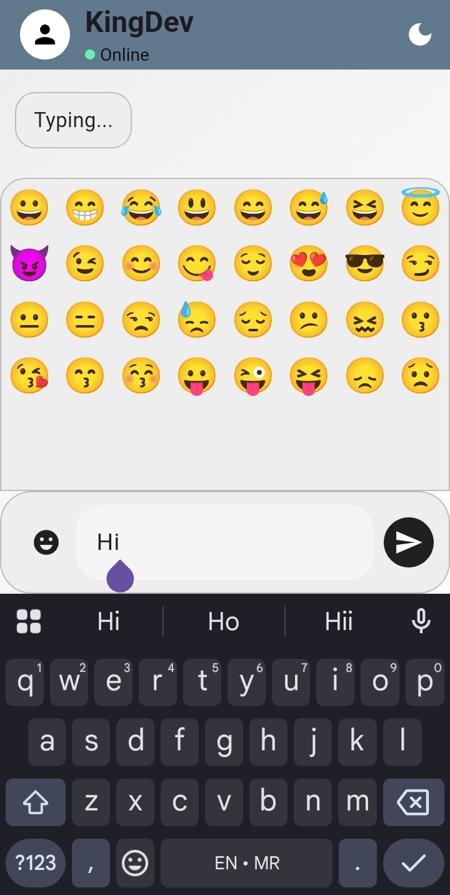
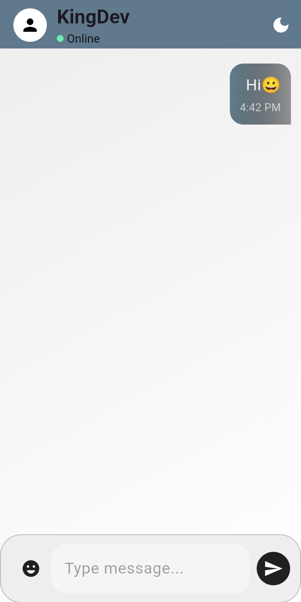
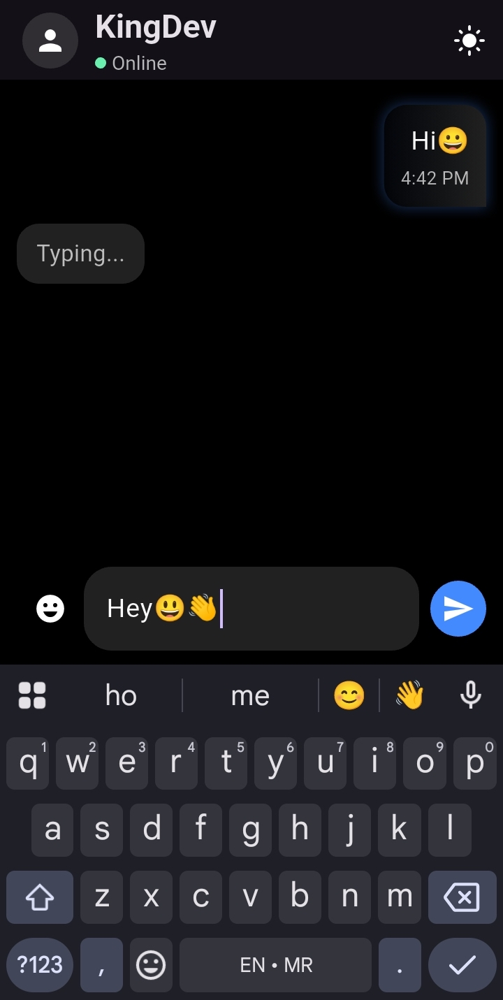
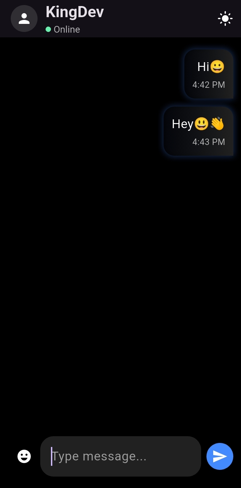

# Flutter Neon Chat UI

A modern **neon-themed chat UI** built with Flutter. Supports **dark mode**, **emoji input**, **typing animations**, and **neon message bubbles**.  


*Animated demo of the chat app in action.*

---

## Screenshots

### Light Mode
<p align="center">
  
  
  
</p>

### Dark Mode
<p align="center">
  
  
  
</p>
 

---

## Features

- Neon-themed chat bubbles  
- Dark & light mode support  
- Emoji picker panel  
- Typing indicator animation  
- Smooth send/receive animations  
- Auto-scroll to latest message  

---

## Getting Started

### Prerequisites

- Flutter SDK installed  
- A device or emulator  

### Installation

1. Clone the repository:  
```bash
git clone https://github.com/yourusername/flutter_chat_ui.git 
```

2. Navigate to the project directory:
```bash
cd flutter_chat_ui 
```

3. Get the dependencies:
```bash
flutter pub get
```

4. Run the app:
```bash
flutter run 
```